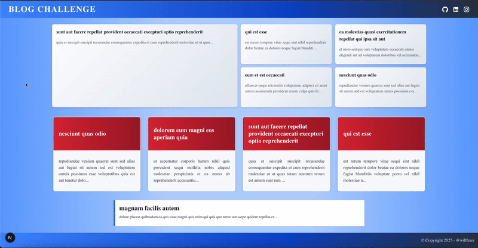

# Blog Challenge / Desafio Blog

## English Version

### About the Challenge

This project is a blog app built with **Next.js** focusing on modern, performant, and best practices development. It consumes public RESTful APIs that return JSON with posts, users, comments, and related data.

### Technologies and Architecture

- **Next.js** with Server-Side Rendering (SSR) for better SEO and initial page load performance.
- **Zod** for schema validation.
- **MVVM (Model-View-ViewModel)** architectural pattern applied throughout the project for clear separation of concerns and maintainability.
- **React Query** to fetch, cache, and update server state efficiently.
- **Material UI** and **Styled Components** for UI design and styling.
- Best practices applied in code organization, component reusability, and performance.

### Features

- **Home Page**: List of posts with title and summary, linking to post detail pages.
- **Post Page (dynamic route)**: Full post content, comments list, and author details.
- **User Page (dynamic route)**: User info and list of posts by that user.

### APIs Used

- Posts: https://jsonplaceholder.typicode.com/posts
- Post Comments: https://jsonplaceholder.typicode.com/posts/[ID]/comments
- Users: https://jsonplaceholder.typicode.com/users
- User Details: https://jsonplaceholder.typicode.com/users/[ID]

### How to Run Locally

1. Clone the repository  
   `git clone <your-repo-url>`
2. Install dependencies  
   `npm install` or `yarn install`
3. Run the development server  
   `npm run dev` or `yarn dev`
4. Open [http://localhost:3000](http://localhost:3000) in your browser.

### Technical Justification

- SSR was chosen for SEO and initial load speed.
- MVVM ensures separation of UI, business logic, and data.
- React Query handles data fetching efficiently, with caching and background updates.
- Zod guarantees runtime data validation.
- Styling with Material UI and Styled Components allows a clean and scalable UI design.

### Social Links

- [GitHub](https://github.com/willferreiras)  
- [LinkedIn](https://www.linkedin.com/in/willferreiras93/)  
- [Instagram](http://instagram.com/willferreiras)

---

## Versão em Português

### Sobre o Desafio

Este projeto é um blog construído com **Next.js** focado em desenvolvimento moderno, performático e boas práticas. Consome APIs públicas RESTful que retornam JSON com posts, usuários, comentários e dados relacionados.

### Tecnologias e Arquitetura

- **Next.js** com Server-Side Rendering (SSR) para melhor SEO e desempenho no carregamento inicial.
- **Zod** para validação de schemas.
- Arquitetura **MVVM (Model-View-ViewModel)** aplicada em todo o projeto para separar responsabilidades e facilitar a manutenção.
- **React Query** para buscar, armazenar em cache e atualizar dados do servidor de forma eficiente.
- **Material UI** e **Styled Components** para design e estilização da interface.
- Boas práticas aplicadas na organização de código, reutilização de componentes e performance.

### Funcionalidades

- **Página Inicial**: Listagem dos posts com título e resumo, com links para páginas de detalhes.
- **Página de Post (rota dinâmica)**: Conteúdo completo do post, lista de comentários e dados do autor.
- **Página de Usuário (rota dinâmica)**: Dados do usuário e listagem dos posts escritos por ele.

### APIs Utilizadas

- Posts: https://jsonplaceholder.typicode.com/posts  
- Comentários do Post: https://jsonplaceholder.typicode.com/posts/[ID]/comments  
- Usuários: https://jsonplaceholder.typicode.com/users  
- Detalhes do Usuário: https://jsonplaceholder.typicode.com/users/[ID]  

### Como Rodar Localmente

1. Clone o repositório  
   `git clone <url-do-seu-repositorio>`
2. Instale as dependências  
   `npm install` ou `yarn install`
3. Rode o servidor de desenvolvimento  
   `npm run dev` ou `yarn dev`
4. Abra [http://localhost:3000](http://localhost:3000) no navegador.

### Justificativa Técnica

- SSR foi escolhido para SEO e velocidade no carregamento inicial.
- MVVM garante separação clara entre UI, lógica de negócio e dados.
- React Query gerencia as requisições de forma eficiente com cache e atualizações em background.
- Zod valida dados em runtime garantindo segurança.
- Material UI e Styled Components permitem um design limpo e escalável.

### Meus Contatos

- [GitHub](https://github.com/willferreiras)  
- [LinkedIn](https://www.linkedin.com/in/willferreiras93/)  
- [Instagram](http://instagram.com/willferreiras)
